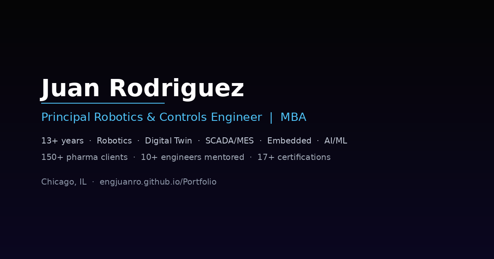

<p align="center">
  
</p>

<h1 align="center">Juan Rodriguez — Mechatronic Engineer</h1>

<p align="center">
  <strong>Principal Robotics & Controls Engineer | 13+ Years | Chicago, IL</strong>
</p>

<p align="center">
  <a href="https://engjuanro.github.io/Portfolio/">
    
  </a>
  &nbsp;
  <a href="https://www.linkedin.com/in/ing-juan-rodriguez/">
    
  </a>
  &nbsp;
  <a href="mailto:juanfro94@gmail.com">
    
  </a>
</p>

---

## About

End-to-end engineering portfolio showcasing **robotics, advanced manufacturing, embedded systems, PCB design, digital twins, and AI-driven automation** across aerospace, biomedical, and industrial domains. Built as a single-page interactive experience with 3D model viewers, scroll-driven animations, and project deep-dives.

**Education:** B.Sc. Mechatronic Engineering (Universidad Militar Nueva Granada) · MBA (European Business University of Barcelona)

---

## Featured Projects

| Domain | Project | Highlights |
|--------|---------|------------|
| **Robotics** | DYS 6-DOF Manipulator | SolidWorks design, ARM firmware, hybrid IK/FK, real-time 3D simulator with interactive viewer |
| **Industrial Robotics** | Nuclear Hot Cells to Palletizing | Robotic cell integration, high-payload systems, Comecer platform |
| **Autonomous Vehicles** | Mobile Robotics + DMS/ADAS | Driver monitoring, sensor fusion, autonomous navigation |
| **PCB Design** | Multi-layer Industrial, Biomedical & IoT | Altium/KiCad, interactive 3D exploded PCB viewer, EEG/PSG boards |
| **Nuclear/Pharma** | Hot Cell Automation | Radiopharmaceutical production, Comecer full platform |
| **IoT Product** | Koolred Temperature Control | SCADA system, product launch, intelligent monitoring |
| **Analytics** | Production Dashboard | OEE, KPIs, defect tracking, Tableau & custom dashboards |
| **Biomedical** | Polysomnography System | Brain-computer interface, EEG signal processing |
| **Computer Vision** | Automated Quality Control | AI-powered defect detection, real-time inspection |
| **IoT** | Sensor Mesh Network | Environmental monitoring, wireless mesh topology |

---

## Tech Stack (Site)

- **3D Rendering:** Three.js r128 — interactive robot & PCB model viewers with GSAP scroll-driven animations
- **Animations:** GSAP 3.12 + ScrollTrigger — pinned sections, parallax, exploded-view timelines
- **Layout:** Pure HTML/CSS — responsive grid, glassmorphism cards, custom loaders
- **Deployment:** GitHub Pages — single `index.html` with zero build steps

---

## Run Locally

```bash
git clone https://github.com/engjuanro/Portfolio.git
cd Portfolio
# Open index.html in your browser — no build tools required
start index.html
```

> **Note:** The 3D PCB viewer uses XHR for progress tracking, which requires HTTP. For full functionality, serve locally:
> ```bash
> npx serve .
> ```

---

<p align="center">
  <a href="https://engjuanro.github.io/Portfolio/">
    
  </a>
</p>
